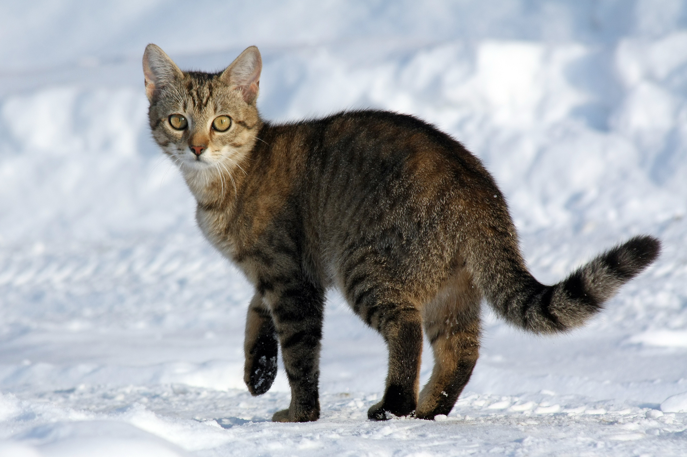

# gitHub1
Curso de GitHub básico

## foto de gato, robada de otra web, con un link


## foto de gato, subida con drag an drop


## foto de gato, subida elegantemente, desde mi repositorio


## Esto es un subtítulo
Esto es un párrafo

##Esto es una Lista
- Lista
- Lista 2
   - Lista 2.1
      - Lista 2.1.1
- Lista 3

#Esto es una lista númerica
1. Lista
2. Lista 
3. Lista 3

# Páginas Útiles

Para buscar preguntas que uno tiene acerca de código, y puedes citar también las respuestas:

https://stackoverflow.com/questions

##Código de Arduino
```// Práctica encender y apagar un LED
const int LED=13;
void setup()
{
pinMode(LED,OUTPUT);
}
void loop()
{
digitalWrite(LED,HIGH);
delay(1000);
digitalWrite(LED,LOW);
delay(1000);
}```
